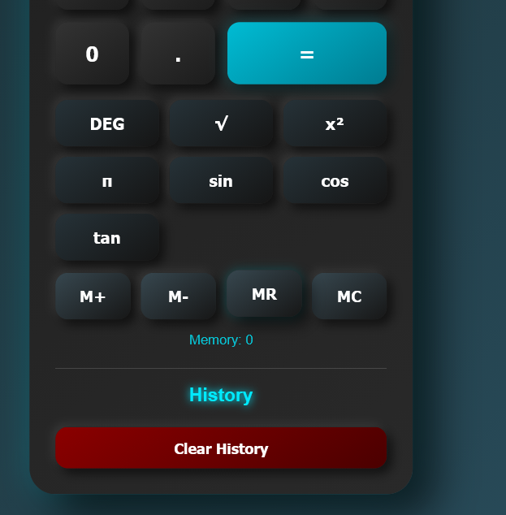

# 🧮 Calculator Full Stack

A full-stack calculator application built with **HTML, CSS, JavaScript, Spring Boot, and MySQL**.

The project combines a responsive calculator frontend with a Spring Boot backend that stores and manages calculation history using MySQL.

## ✨ Features

### Calculator

* Basic arithmetic operations
* Scientific calculator functions
* DEG / RAD angle modes
* Square root (√)
* Square (x²)
* Pi (π)
* Sin, Cos and Tan
* Memory functions: M+, M-, MR, MC
* Keyboard support
* Input validation

### User Interface

* Dark / Light theme
* Sound toggle
* Animated calculator title
* Calculation history
* Individual history deletion
* Clear history option
* Responsive interface

### Topics 

calculator
full-stack
java
spring-boot
mysql
javascript
html
css
rest-api
web-development

### Backend

* Spring Boot REST API
* MySQL database integration
* Calculation history persistence
* GET, POST and DELETE APIs
* JPA / Hibernate

## 🛠️ Technologies Used

### Frontend

* HTML5
* CSS3
* JavaScript

### Backend

* Java
* Spring Boot
* Spring Data JPA
* Hibernate

### Database

* MySQL

### Tools

* VS Code
* MySQL Workbench
* Maven
* Git & GitHub

## 📁 Project Structure

```text
calculator-full-stack/
│
├── frontend/
│   ├── index.html
│   ├── script.js
│   └── style.css
│
├── backend/
│   ├── src/
│   ├── pom.xml
│   └── ...
│
├── .gitignore
└── README.md
```

## 🔗 Backend API

Base URL:

```text
http://localhost:8080/api/calculations
```

### Get Calculation History

```http
GET /api/calculations
```

### Save Calculation

```http
POST /api/calculations
```

### Delete All History

```http
DELETE /api/calculations
```

### Delete One Calculation

```http
DELETE /api/calculations/{id}
```
## 📸 Screenshots

### Light Mode


### Dark Mode


### Scientific Calculator & History



## ⚙️ Setup

### 1. Clone the repository

```bash
git clone https://github.com/sumiNoob123/calculator-full-stack.git
```

### 2. Configure MySQL

Create a MySQL database named:

```text
calculator_db
```

Configure your local database password in:

```text
backend/src/main/resources/application-local.properties
```

This file is intentionally excluded from Git using `.gitignore`.

### 3. Run the Backend

Open the backend directory:

```bash
cd backend
```

Then run:

```bash
./mvnw spring-boot:run
```

On Windows PowerShell:

```powershell
.\mvnw.cmd spring-boot:run
```

The backend runs on:

```text
http://localhost:8080
```

### 4. Run the Frontend

Open:

```text
frontend/index.html
```

in a browser.

Make sure the Spring Boot backend is running when using calculation history.

## 🔐 Security

Database credentials are stored in a local configuration file:

```text
application-local.properties
```

The file is excluded from Git using `.gitignore` and should **never be committed to GitHub**.

## 🚀 Future Improvements

* User authentication
* Better API validation
* Improved error handling
* Deployment to a cloud platform
* More scientific calculator functions
* Automated testing
* Improved mobile responsiveness

## 👩‍💻 Author

**Sumitra Sharma**

GitHub: [@sumiNoob123](https://github.com/sumiNoob123)

---

⭐ If you find this project useful, feel free to explore the repository.
